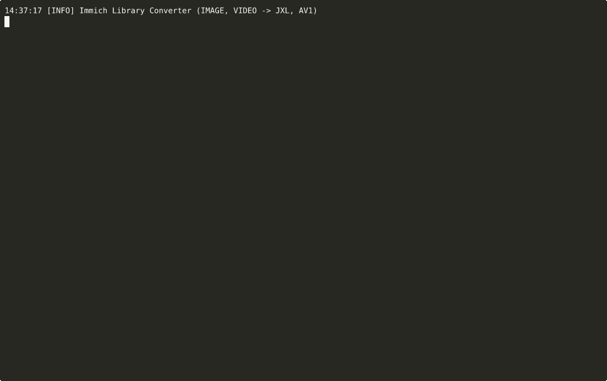
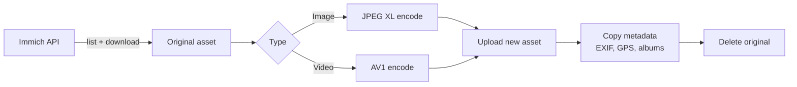

# Immich Library Converter

[](https://github.com/fabianwimberger/immich-convert-originals/actions)
[](https://codecov.io/gh/fabianwimberger/immich-convert-originals)
[](https://github.com/fabianwimberger/immich-convert-originals/pkgs/container/immich-convert-originals)
[](https://opensource.org/licenses/MIT)

Batch-transcode your Immich library to modern efficient formats:
- **Images** → JPEG XL (JXL)
- **Videos** → AV1 (MP4 container)

This tool downloads your original assets, transcodes them to space-efficient formats, uploads the new versions, copies all metadata (EXIF, location, tags, albums, etc.), and removes the originals.

## Background

JPEG XL shrinks photos by 20-40% and AV1 shrinks videos by 30-50% with no visible quality loss. On a multi-TB Immich library that adds up fast. This scans the library, transcodes in place, preserves EXIF, GPS, and album membership, and removes originals only after the upload succeeds. Dry-run is always available.

<p align="center">
  
  <br><em>Scans Immich library, transcodes to JXL/AV1, preserves metadata, reports savings</em>
</p>

## Features

- **Image conversion** — JPEG, PNG, WebP, HEIC → JPEG XL
- **Video conversion** — MP4, MOV, MKV → AV1 (MP4)
- **Metadata preservation** — EXIF, GPS, tags, albums, faces
- **Smart retry logic** — automatically retries with higher compression if output is larger
- **Dry-run mode** — preview changes before executing
- **Date filtering** — process only assets within a date range
- **Concurrency control** — configurable parallel workers

## Pipeline



## Quick Start

### Option 1: Prebuilt Docker Image (Recommended)

The easiest way to run the tool is using the prebuilt image from GitHub Container Registry:

```bash
# Create a directory for your configuration
mkdir immich-converter && cd immich-converter

# Download the example environment file
curl -O https://raw.githubusercontent.com/fabianwimberger/immich-convert-originals/main/.env.example
mv .env.example .env

# Edit .env with your Immich URL and API key
nano .env

# Run with dry run first to preview
docker run --rm --env-file .env ghcr.io/fabianwimberger/immich-convert-originals:main

# When ready, disable dry run and run for real
# Edit .env: set DRY_RUN=false
docker run --rm --env-file .env ghcr.io/fabianwimberger/immich-convert-originals:main
```

### Option 2: Docker Compose (Build Locally)

```bash
# Clone the repository
git clone https://github.com/fabianwimberger/immich-convert-originals.git
cd immich-convert-originals

# Copy and edit configuration
cp .env.example .env
# Edit .env with your Immich URL and API key

# Start with dry run to preview
DRY_RUN=true docker compose up

# When ready, run for real
docker compose up
```

### Option 3: Local Python

```bash
# Clone the repository
git clone https://github.com/fabianwimberger/immich-convert-originals.git
cd immich-convert-originals

# Install dependencies
pip install -r requirements.txt

# See all available options
python -m app --help

# Run with environment variables
IMMICH_API_BASE=https://photos.example.com/api \
IMMICH_API_KEY=your_key \
DRY_RUN=true \
python -m app

# Or pass options as CLI flags
python -m app \
  --api-base https://photos.example.com/api \
  --api-key your_key \
  --dry-run \
  --max-assets 10
```

## How It Works

```
Search assets → Download → Transcode → Upload new → Copy metadata → Delete original
```

Each step is verified:
1. **Download** original to temp directory
2. **Transcode** based on asset type
3. **Validate** output format and integrity
4. **Upload** new asset to Immich
5. **Copy metadata** (EXIF, GPS, tags, albums, faces, etc.)
6. **Verify** new asset is accessible
7. **Delete** original (goes to trash, recoverable for 30 days)

If any step fails, the new asset is cleaned up and the original is preserved.

## Configuration

### Required Settings

| Variable | Description | Example |
|----------|-------------|---------|
| `IMMICH_API_BASE` | Your Immich API URL | `https://photos.example.com/api` |
| `IMMICH_API_KEY` | API key from Immich | `abc123...` |

**Always start with `DRY_RUN=true` (the default) to test your settings.**

### Encoding Settings

| Variable | Description | Default |
|----------|-------------|---------|
| `IMAGE_DISTANCE` | JXL distance (0=lossless, 1=visually lossless) | `1.0` |
| `VIDEO_CRF` | AV1 quality (0-63, lower=better) | `36` |
| `VIDEO_PRESET` | AV1 speed/quality tradeoff (0-13, lower=slower) | `4` |

## Security & Safety

**⚠️ USE AT YOUR OWN RISK.** This tool deletes originals after conversion (recoverable via Immich trash for 30 days). Always backup first and test on a small subset with `MAX_ASSETS`.

## Docker Image Tags

Images are available from `ghcr.io/fabianwimberger/immich-convert-originals`. Use `main` for latest, or pin to a release tag (`v1`, `v1.2`, `v1.2.3`).

## License

MIT License — see [LICENSE](LICENSE) file.

### Third-Party Licenses

| Component | License | Source |
|-----------|---------|--------|
| libjxl | [BSD-3-Clause](https://github.com/libjxl/libjxl/blob/main/LICENSE) | https://github.com/libjxl/libjxl |
| FFmpeg | [LGPL v2.1+](https://www.gnu.org/licenses/old-licenses/lgpl-2.1.html) | https://ffmpeg.org/ |
| ImageMagick | [Apache-2.0](https://imagemagick.org/script/license.php) | https://imagemagick.org/ |
| ExifTool | [Artistic/GPL](https://exiftool.org/#license) | https://exiftool.org/ |

See [DOCKER_LICENSES.md](DOCKER_LICENSES.md) for full details.
