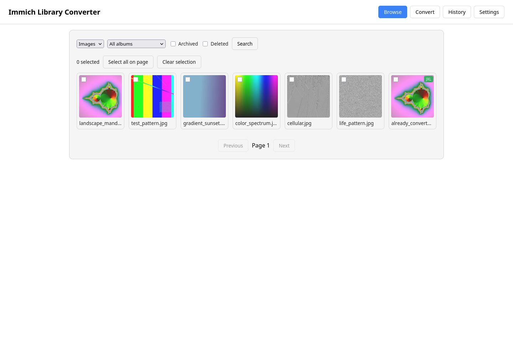
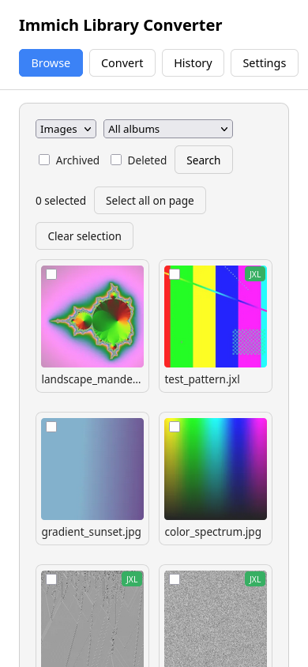
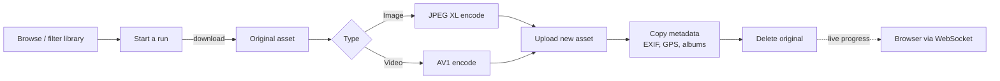
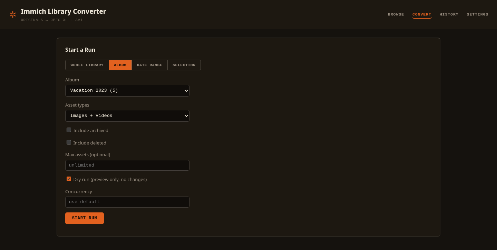
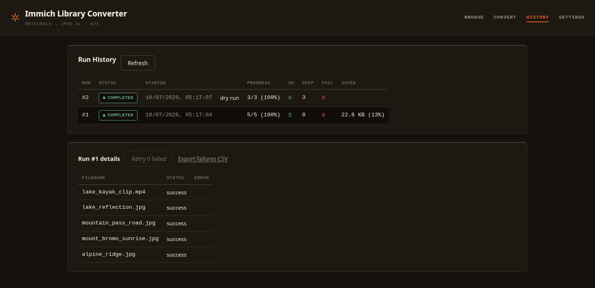

# Immich Library Converter

[](https://github.com/fabianwimberger/immich-convert-originals/actions)
[](https://codecov.io/gh/fabianwimberger/immich-convert-originals)
[](https://github.com/fabianwimberger/immich-convert-originals/pkgs/container/immich-convert-originals)
[](https://opensource.org/licenses/MIT)

> **Disclaimer**: This is an independent, community-created project. It is **not affiliated with, endorsed by, or sponsored by Immich**. "Immich" and its associated logos are trademarks of their respective owners. Use of the name is solely for identification and compatibility purposes. Use at your own risk.

A self-hosted, web-based tool that batch-transcodes your Immich library to modern, space-efficient formats:
- **Images** → JPEG XL (JXL)
- **Videos** → AV1 (MP4 container)

Browse your library, pick what to convert (or filter by type/album/date), and watch live progress in the browser. It downloads originals, transcodes them, uploads the new versions, preserves EXIF/GPS data and album membership, and removes the originals only once the upload is verified.

## Background

JPEG XL shrinks photos by 20-40% and AV1 shrinks videos by 30-50% with no visible quality loss. On a multi-TB Immich library that adds up fast. This tool used to be a CLI you configured entirely through `.env` files — it's now a proper web UI: connect once, browse your library with real thumbnails, and start a conversion run with a click. Dry-run is always available before you commit to anything.

| Desktop | Mobile |
|---------|--------|
|  |  |

## Features

- **Asset browser** — filter by type, album, archived/deleted state; real Immich thumbnails proxied through the backend (your API key never reaches the browser)
- **Flexible run scoping** — convert the whole library, one album, a date range, or an explicit selection from Browse
- **Image conversion** — JPEG, PNG, WebP, HEIC → JPEG XL
- **Video conversion** — MP4, MOV, MKV → AV1 (MP4)
- **Live progress** — WebSocket-driven progress bar, running counts, and current-asset status while a run is in flight
- **Metadata preservation** — EXIF, GPS, favorite state, rating, and albums copied to the replacement asset
- **Smart retry logic** — automatically retries with higher compression if output is larger than the original
- **Run history** — every run and its per-asset outcomes are kept; drill into failures, retry just the failed assets, or export a failure CSV
- **Resumable** — a filtered run automatically skips assets a previous run already converted successfully
- **Settings in the UI** — connection details, default encoding, and output mode are all edited and saved from the Settings page, no restart or `.env` file required
- **Dry-run mode** — preview what a run would do before committing to it
- **Concurrency control** — configurable parallel workers per run

## Pipeline



## Quick Start

### Option 1: Prebuilt Docker Image (Recommended)

```bash
# Create a directory for your configuration
mkdir immich-converter && cd immich-converter

# Create the host-side data directory before the first run. Docker
# auto-creates missing bind-mount sources as root, which the container
# (running as uid 1000) cannot write to. Pre-creating it avoids that.
mkdir -p data

docker run -d \
  --name immich-library-converter \
  --restart unless-stopped \
  -p 8000:8000 \
  -v ./data:/app/data \
  ghcr.io/fabianwimberger/immich-convert-originals:main

# Open http://localhost:8000, set your Immich URL/API key on the
# Settings page, and start browsing.
```

### Option 2: Docker Compose (Build Locally)

```bash
git clone https://github.com/fabianwimberger/immich-convert-originals.git
cd immich-convert-originals

# Create the host-side data directory before the first run (see Option 1 for why)
mkdir -p data

docker compose up -d
# Open http://localhost:8000, then set your Immich URL/API key on the Settings page
```

### Option 3: Local Development

```bash
git clone https://github.com/fabianwimberger/immich-convert-originals.git
cd immich-convert-originals

python -m venv .venv
.venv/bin/pip install -r backend/requirements-dev.txt

# ffmpeg, ImageMagick (with JXL delegate), libjxl-tools, and exiftool
# must be installed on the host for local (non-Docker) runs.

FRONTEND_DIR=./frontend \
DATABASE_PATH=./data/app.db \
TEMP_DIR=./data/temp \
.venv/bin/uvicorn app.main:app --app-dir backend --reload --port 8000
```

## Web UI

Open `http://localhost:8000` after starting the container.

- **Browse** — filter your library by type, album, or archived/deleted state; thumbnails load lazily; multi-select assets to convert a specific subset, or select-all-on-page for larger batches
- **Convert** — start a run against the whole library, one album, a date range, or your Browse selection; toggle dry-run and per-run concurrency; watch live progress once it starts
- **History** — every run with its counts and bytes saved; click a run to see per-asset outcomes, retry just the failed ones, or export a failure CSV
- **Settings** — Immich connection (with a test-connection check), default encoding values, and retry/safety behavior — all saved to the app's database, no restart required

<p align="center">
  
  <br><em>Start a run against the whole library, one album, a date range, or a Browse selection</em>
  <br><br>
  
  <br><em>Run history with per-run savings; drill in for per-asset outcomes and retry-failed</em>
</p>

## How It Works

```
Browse/filter → Download → Transcode → Upload new → Copy metadata → Verify → Delete original
```

Each step is verified:
1. **Download** original to a temporary per-run directory
2. **Transcode** based on asset type (skip if already JPEG XL / AV1)
3. **Validate** output format and integrity; retry with more compression if the output is larger than the input
4. **Upload** new asset to Immich
5. **Copy metadata** (EXIF, GPS, favorite state, rating, and albums)
6. **Verify** new asset is accessible
7. **Delete** original (goes to Immich's trash, recoverable for 30 days)

If any step fails, the new asset is cleaned up and the original is preserved. The outcome is recorded either way, so a failed run shows up in History with the exact error.

## Configuration

Everything behavioral — Immich connection, encoding defaults, filters, output mode — is configured from the **Settings** page in the web UI, no restart required. The only environment variables the app reads are infrastructure that has to exist before the database is reachable, and none of them need to be set for a normal install:

| Variable | Description | Default |
|----------|-------------|---------|
| `DATABASE_PATH` | Path to the app's SQLite database (settings + run history) | `/app/data/app.db` |
| `TEMP_DIR` | Scratch directory for in-flight downloads/transcodes | `/app/temp` |
| `LOG_LEVEL` | Log verbosity | `INFO` |
| `CORS_ORIGINS` | Comma-separated origins allowed to call the API | `http://localhost:8000,http://127.0.0.1:8000` |

## Security & Safety

**USE AT YOUR OWN RISK.** This tool deletes originals after conversion (recoverable via Immich trash for 30 days). Always back up first and test on a small selection before converting a whole library. The web UI has no built-in authentication — it's intended for a trusted home network or behind your own reverse-proxy auth; don't expose it directly to the internet.

## Docker Image Tags

Images are available from `ghcr.io/fabianwimberger/immich-convert-originals`. Use `main` for latest, or pin to a release tag (`v2`, `v2.0`, `v2.0.0`).

## License

MIT License — see [LICENSE](LICENSE) file.

### Third-Party Licenses

| Component | License | Source |
|-----------|---------|--------|
| libjxl | [BSD-3-Clause](https://github.com/libjxl/libjxl/blob/main/LICENSE) | https://github.com/libjxl/libjxl |
| FFmpeg | [LGPL v2.1+](https://www.gnu.org/licenses/old-licenses/lgpl-2.1.html) | https://ffmpeg.org/ |
| ImageMagick | [Apache-2.0](https://imagemagick.org/script/license.php) | https://imagemagick.org/ |
| ExifTool | [Artistic/GPL](https://exiftool.org/#license) | https://exiftool.org/ |
| FastAPI | [MIT](https://github.com/fastapi/fastapi/blob/master/LICENSE) | https://fastapi.tiangolo.com/ |
| SQLAlchemy | [MIT](https://github.com/sqlalchemy/sqlalchemy/blob/main/LICENSE) | https://www.sqlalchemy.org/ |

See [DOCKER_LICENSES.md](DOCKER_LICENSES.md) for full details.
